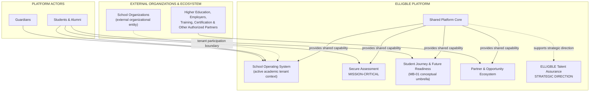

**Status:** LOCKED
**Version:** 1.0.0
**Canonical:** YES
**Phase:** MASTER BLUEPRINT
**Unit ID:** MB-01
**Depends On:** MB-00, D01 v1.0.0, D02 v1.0.0, D03 v1.0.0, D04 v1.0.1
**Used By:** MB-02 and later Master Blueprint units only after MB-01 is LOCKED
**Last Reviewed:** 2026-08-15

# ELLIGBLE Platform System Map

## 1. Purpose

The Platform System Map defines the high-level product/system landscape for ELLIGBLE. It establishes the major product/system areas, ecosystem boundaries, and conceptual relationships that form the foundation of the platform.

This document serves as the conceptual blueprint used by later Master Blueprint units (MB-02 and beyond). It does not describe technical architecture, APIs, or database schemas.

## 2. Authority and Scope

This unit derives from:
- Recovery Freeze where still applicable
- D01 LOCKED
- D02 LOCKED
- D03 LOCKED
- D04 LOCKED
- Decision Hierarchy
- Canonical Terminology

MB-01 cannot silently override upstream LOCKED/FROZEN decisions.

## 3. What MB-01 Decides

This unit decides only:
- high-level ELLIGBLE system landscape
- major product/system areas
- academic tenant boundary
- platform-wide shared capability layer
- student journey/future-readiness landscape
- Partner & Opportunity ecosystem boundary
- external ecosystem boundary
- conceptual high-level relationships
- mission-critical positioning of Secure Assessment
- strategic placement of Talent Assurance

## 4. What MB-01 Does NOT Decide

This unit explicitly defers the following:
- Detailed domain/module decomposition → MB-02
- Actor/role/context mapping → MB-03
- Detailed journeys/workflows → MB-04
- Data trust/provenance/continuity → MB-05
- Detailed security/privacy/risk → MB-06
- Detailed reliability/failure containment → MB-07
- Cross-domain contracts/integrations → MB-08
- Delivery sequence → MB-09
- Full Baseline/Future/Exclusions matrix → MB-10
- Traceability matrix → MB-11
- Exit gate → MB-12
- Technical architecture → later Architecture phase

## 5. ELLIGBLE Product Identity

ELLIGBLE is:
- multi-tenant education-to-future platform
- integrated upper-secondary education platform
- trusted continuity layer connecting the school journey with future opportunity/readiness contexts

ELLIGBLE is NOT:
- CBT-only
- LMS-only
- full SIS/ERP replacement
- LinkedIn clone
- social-media feed
- follower/friend network
- AI-dependent
- student-data marketplace

**Secure Assessment:**
HIGHEST-PRIORITY FLAGSHIP / ADOPTION WEDGE

**SMA N 1 Mlati:**
PILOT / REFERENCE TENANT ONLY (SMA N 1 Mlati is not the identity of ELLIGBLE).

## 6. Top-Level ELLIGBLE System Landscape

The landscape consists of these HIGH-LEVEL areas:

- **A. Shared Platform Core**
- **B. School Operating System**
- **C. Secure Assessment**
- **D. Student Journey & Future Readiness**
  - Track
  - Passport
  - Path
  - Alumni & Impact
- **E. Partner & Opportunity Ecosystem**
- **F. ELLIGBLE Talent Assurance**
  - strategic direction
  - not finalized Day-One operational subsystem

**MB-01 landscape grouping note:** `Student Journey & Future Readiness` is a conceptual umbrella used only in this system map for readability. It does not establish a new canonical bounded domain or replace the upstream status of Track, Passport, Path, and Alumni & Impact as separately recognized canonical areas. Detailed domain/module decomposition remains deferred to MB-02.

## 7. Conceptual Platform System Map

**Diagram interpretation safeguards:**
- `Shared Platform Core` provides common conceptual capability to relevant ELLIGBLE areas; arrows are not data-flow, API, or technical dependency contracts.
- `Student Journey & Future Readiness` is an MB-01 visual umbrella only. It does not impose a rigid sequence among Track, Passport, Path, and Alumni & Impact.
- No linear chain is implied between School Operating System, Secure Assessment, Student Journey & Future Readiness, Partner & Opportunity Ecosystem, and Talent Assurance.
- `School Organizations` represents the organizational entity at the ecosystem boundary. Once participating as an academic tenant, the school operates through the ELLIGBLE academic tenant context represented inside `School Operating System`.
- `Students & Alumni` and `Guardians` are shown as platform actors, not as external systems or product areas.
- Partner & Opportunity Ecosystem remains separate from academic tenant membership.

## 8. Academic Tenant Boundary

**Academic tenant baseline:**
- SMA
- SMK
- MA
- MAK
- equivalent upper-secondary institutions

**Excluded:**
- SMP
- MTs

**Baseline:**
one school = one academic tenant

**Preserved Boundaries:**
Organization ≠ Tenant
Beyond-school institutions do not automatically become academic tenants.

**SMA N 1 Mlati:**
pilot/reference only.

## 9. Shared Platform Core

High-level common capabilities provide shared platform capability across relevant ELLIGBLE areas. These may include:
- Identity
- Organization/Tenant context
- Access Control
- Notification
- Messaging
- Search
- Feedback & Support
- Audit
- Privacy / Trust / Security

**Source-boundary note:** This list is inherited landscape inventory from existing canonical context. MB-01 is not using it to establish a new module tree, ownership model, service boundary, or final MB-02 decomposition.

These are conceptual capabilities, not microservices, technical ownership assignments, or API boundaries.

## 10. School Operating System

Represented at a high level:
- Academic Core
- Learn
- Student Administration
- Parent/Guardian
- Care
- School Insight

**Source-boundary note:** These named areas are inherited landscape inventory from existing canonical context. Their inclusion here does not constitute a new MB-01 module-decomposition decision; detailed domain/module boundaries remain MB-02 work.

**Preserved Rules:**
- Academic Core → minimum shared academic truth
- Academic Core → NOT a full SIS/ERP
- GENERAL SCHOOL TIMETABLE → OUT OF CURRENT BASELINE
- GENERAL SCHOOL ATTENDANCE → OUT OF CURRENT BASELINE
- Learn → OPTIONAL
- Discipline placement → OPEN (NO DISCIPLINE LOCATION INVENTED)

## 11. Secure Assessment

**Classification:** MISSION-CRITICAL PRODUCT AREA

At a conceptual responsibility level only, it covers:
- trusted assessment lifecycle
- assessment/question preparation
- exam execution
- participant/session context
- autosave/recovery
- scoring
- proctoring
- anti-cheating/risk evidence

**Preserved Constraints:**
- No Lost Answers
- Server-authoritative timer
- Idempotent submission
- Active assessment must not be destabilized by failure of noncritical ELLIGBLE areas
- Teacher ≠ Proctor globally
- Teacher-managed assessment may receive scoped contextual monitoring capability according to D04
- Violation Event ≠ Risk Signal ≠ Incident ≠ Cheating Decision
- Risk signal ≠ verdict
- Personal mobile data/hotspot: ALLOWED
- School Wi-Fi: NOT MANDATORY
- Network/IP/location signal: NOT cheating proof

## 12. Student Journey & Future Readiness

`Student Journey & Future Readiness` is used in MB-01 only as a conceptual landscape umbrella. Track, Passport, Path, and Alumni & Impact remain separately recognized canonical areas; MB-01 does not merge them into a new bounded domain.

**Track:**
High-level: ongoing progress / development / follow-up context.

**Passport:**
High-level: trusted portable representation of student identity/evidence/history.

**Path:**
High-level: future planning, goals, direction, post-school pathways/opportunities.

**Alumni & Impact:**
High-level: continuity after graduation and understanding transition/outcomes.

**Preserved Rules:**
- Student → Alumni is lifecycle/context continuity. Do NOT create an unrelated second identity.
- Do NOT promise admission.
- Do NOT promise employment.

## 13. Partner & Opportunity Ecosystem

This is treated as ONE high-level MB-01 ecosystem area. Concepts inside this landscape may include:
- Partner Organization
- Opportunity
- Application
- Verified Connection
- Outcome

*(Note: These are not five separate bounded domains. That determination belongs to MB-02.)*

Beyond-school ecosystem may conceptually include:
- higher education institutions
- employers
- training providers
- certification organizations
- entrepreneurship/business opportunity providers
- other authorized partners

**Preserved Rules:**
- Partner access is purpose-limited.
- Partner access is consent/authorization-aware.
- Partners do NOT have unrestricted student search.
- Higher-education source strategy: OPEN (not resolved).

## 14. ELLIGBLE Talent Assurance

**Normalized Status:**
STRATEGIC STATUS: APPROVED STRATEGIC DIRECTION
PRODUCT MECHANISM MATURITY: FUTURE / PROVISIONAL as supported by D01.2A
LEGAL / COMMERCIAL MECHANISM: REQUIRES DEDICATED DISCOVERY
BASELINE: DO NOT IMPLEMENT GUARANTEE MECHANISM YET

**Conceptual Representation:**
Talent Assurance is an evidence-backed credibility/readiness assurance direction using trusted ELLIGBLE evidence and journey records. 
It does NOT imply ELLIGBLE legally guarantees employment. MB-01 does NOT create a guarantee promise, job guarantee, admission guarantee, underwriting model, scoring formula, fee model, success-fee mechanics, algorithm, AI model, API, or workflow.

## 15. Platform Identity & Lifecycle Continuity

**Preserved Rules:**
- Person ≠ User Account ≠ Membership
- Organization ≠ Tenant
- Student identity can continue across lifecycle according to canonical rules.
- Alumni is lifecycle/context.

MB-01 does NOT define ID formats, database structure, account schema, membership tables, or technical identity architecture.

## 16. Conceptual Relationships Between Major Areas

- Shared Platform Core provides common platform capability.
- Academic Core provides shared academic context for relevant school-facing capabilities.
- Secure Assessment generates trusted assessment evidence/results that may support permitted downstream student progress/trust contexts.
- Track supports understanding student progress.
- Passport represents trusted identity/evidence context.
- Path supports future planning and direction.
- Partner & Opportunity Ecosystem connects authorized opportunity and outcome contexts.
- Alumni & Impact preserves post-graduation continuity.
- Talent Assurance is an evidence-backed strategic assurance direction.

These relationships do NOT define APIs, event messages, payloads, database links, foreign keys, or technical contracts.

## 17. External Ecosystem Boundary

ELLIGBLE distinguishes between **external organizations/ecosystem entities**, **platform actors**, and **internal product/system areas**.

External organizations/ecosystem entities may include:
- school organizations outside or prior to an active ELLIGBLE academic-tenant context
- higher education
- employers
- training organizations
- certification organizations
- entrepreneurship/business opportunity providers
- other authorized partners

Platform actors may include:
- students
- guardians
- alumni

A school organization is not permanently classified as external once it participates in ELLIGBLE. An onboarded academic school operates through an ELLIGBLE academic tenant context, while the underlying school organization remains conceptually distinct from the Tenant (`Organization ≠ Tenant`).

Likewise, students, guardians, and alumni are not external systems merely because they are shown outside product-area boxes in a conceptual map. They are actors who may hold authorized platform access/membership according to canonical identity and access rules.

Not every external organization is an academic tenant. External ecosystem participation does not automatically grant access to private student data. Integrations are NOT defined in this phase.

## 18. Mission-Critical Boundary

At HIGH LEVEL ONLY:
Secure Assessment → mission-critical.
Noncritical area degradation/failure must not destabilize an active exam.

## 19. Baseline Safeguards

**Preserved Rules:**
- WEB-FIRST
- MOBILE-FIRST STUDENT UX
- MULTI-PLATFORM-READY DIRECTION
- AI → FUTURE / OPTIONAL / NON-BLOCKING
- Privacy → default-protective
- Partner unrestricted student discovery → prohibited
- Social feed/follower/friend model → rejected
- Automatic cheating verdict → rejected
- Guaranteed employment/admission → rejected

## 20. OPEN / PROVISIONAL / FUTURE Relevant to MB-01

**OPEN AND MATERIAL:**
- Discipline placement → OPEN → DO NOT PLACE
- Higher-education source strategy → OPEN → higher education may appear conceptually as ecosystem actor → source/integration strategy remains undecided

**Talent Assurance:**
- strategic direction → APPROVED
- product mechanism → FUTURE / PROVISIONAL per canonical source
- legal/commercial mechanism → requires dedicated discovery

**FUTURE capabilities not promoted to baseline:**
- all AI
- native mobile apps
- biometrics
- AI proctoring
- standardized ELLIGBLE assessment
- sponsored opportunities
- custom domains
- merchant expansion
- public alumni directory opt-in
- advanced mentoring
- full E-Rapor

## 21. Explicit Non-Goals

MB-01 does NOT authorize:
- detailed MB-02 domain decomposition
- ERD, database schema, tables, columns, foreign keys
- API routes, endpoints, payload schemas
- event bus, brokers, queues, microservices
- frameworks, technology stack, deployment topology, infrastructure
- InsForge implementation, migrations
- frontend/backend implementation
- Agent Skills, Build Units

## 22. MB-01 Exit Checklist

[x] product identity preserved
[x] high-level system landscape complete
[x] academic tenant boundary correct
[x] Shared Platform Core visible
[x] School Operating System visible
[x] Secure Assessment clearly mission-critical
[x] Track visible
[x] Passport visible
[x] Path visible
[x] Alumni & Impact visible
[x] Partner & Opportunity Ecosystem boundary visible
[x] Talent Assurance correctly represented as strategic direction
[x] external ecosystem boundary visible
[x] Organization ≠ Tenant preserved
[x] Person ≠ User Account ≠ Membership preserved
[x] timetable not reintroduced
[x] attendance not reintroduced
[x] Learn remains optional
[x] Discipline remains OPEN
[x] higher-education source strategy remains OPEN
[x] AI not promoted to baseline
[x] no social-media framing
[x] no job/admission guarantee
[x] no MB-02 premature decomposition
[x] no Architecture leakage
